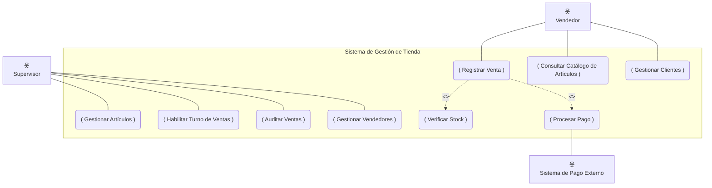

¡Hola! ¡Qué excelente iniciativa la tuya! Usar un ejercicio para profundizar de esta manera es la mejor forma de aprender. Me entusiasma mucho ser tu guía en este proceso. Vamos a desmenuzar este ejercicio de Ingeniería de Software II y convertirlo en una sólida base de conocimiento para ti.

¡Empecemos!

---

## Identificación de temas clave

Para resolver este ejercicio correctamente y, más importante aún, para entenderlo a fondo, necesitas dominar los siguientes temas:

1.  **Ingeniería de Requisitos:**
    *   **Explicación:** Es la disciplina dentro de la Ingeniería de Software que se encarga de descubrir, analizar, documentar y validar los requisitos de un sistema. Es el "QUÉ" debe hacer el sistema. Este ejercicio es fundamentalmente un ejercicio de elicitación y modelado de requisitos funcionales.
    *   **Importancia:** Si no entendemos bien qué se necesita, construiremos un sistema incorrecto o incompleto.

2.  **Casos de Uso (CU):**
    *   **Explicación:** Son una técnica para capturar los requisitos funcionales de un sistema. Describen la interacción entre un actor (usuario o sistema externo) y el sistema para lograr un objetivo específico. Responden a la pregunta: "¿Qué puede hacer un actor con el sistema?".
    *   **Importancia:** Son la base para el diseño, desarrollo y pruebas. Nos ayudan a comunicarnos con los stakeholders (clientes, usuarios) de forma clara.

3.  **Actores:**
    *   **Explicación:** Un actor es cualquier entidad externa al sistema que interactúa con él. Puede ser un humano (usuario), otro sistema de software, o incluso hardware.
    *   **Importancia:** Identificar correctamente los actores es crucial para definir los límites del sistema y los casos de uso relevantes.

4.  **Diagramas de Casos de Uso:**
    *   **Explicación:** Es una representación gráfica de los casos de uso, los actores y sus relaciones. Utiliza la notación estándar de UML (Lenguaje Unificado de Modelado).
    *   **Importancia:** Proporcionan una vista de alto nivel de la funcionalidad del sistema y quién la utiliza. Son una herramienta de comunicación visual.

5.  **Relaciones entre Casos de Uso:**
    *   **Explicación:** Los casos de uso pueden relacionarse entre sí. Las relaciones más comunes son:
        *   **Asociación:** Indica la comunicación entre un actor y un caso de uso.
        *   **Inclusión (`<<include>>`):** Un caso de uso base *siempre* incluye la funcionalidad de otro caso de uso. Es obligatorio.
        *   **Extensión (`<<extend>>`):** Un caso de uso puede *opcionalmente* extender la funcionalidad de otro caso de uso base bajo ciertas condiciones.
        *   **Generalización:** Un caso de uso (o actor) hijo hereda el comportamiento y estructura de un caso de uso (o actor) padre, pero puede añadir o modificar comportamiento.
    *   **Importancia:** Ayudan a estructurar y simplificar los modelos de casos de uso, evitando la redundancia y mostrando dependencias.

---

## Explicación teórica de cada tema

### 1. Ingeniería de Requisitos

La ingeniería de requisitos es el proceso de definir, documentar y mantener los requisitos. Su objetivo es asegurar que el sistema que se construya sea el que el cliente necesita.
*   **Elicitación:** Descubrir los requisitos (entrevistas, cuestionarios, observación).
*   **Análisis:** Comprenderlos, resolver conflictos, priorizar.
*   **Especificación:** Documentarlos de forma clara y precisa (ej. Casos de Uso).
*   **Validación:** Asegurar que los requisitos documentados son los correctos.
*   **Gestión:** Manejar los cambios en los requisitos a lo largo del tiempo.

### 2. Casos de Uso (CU)

Un caso de uso describe una secuencia de acciones que un sistema realiza para producir un resultado observable y de valor para un actor particular.
*   **Características:**
    *   Iniciado por un actor.
    *   Proporciona un valor medible al actor.
    *   Es completo (tiene un inicio y un fin definidos).
*   **Formato:**
    *   **Nombre:** Verbo en infinitivo + complemento (ej. "Registrar Venta").
    *   **Actores:** Quiénes participan.
    *   **Precondiciones:** Qué debe ser cierto antes de que el CU comience.
    *   **Flujo Principal (o Básico):** La secuencia "feliz" de pasos.
    *   **Flujos Alternativos:** Otras secuencias válidas.
    *   **Flujos de Excepción:** Qué sucede si algo sale mal.
    *   **Postcondiciones:** Qué debe ser cierto después de que el CU termine (con éxito o fracaso).
    *   *Nota: Para este ejercicio, nos centraremos en la identificación y el diagrama, no en la descripción textual detallada de cada CU, aunque es bueno saber que existe.*

### 3. Actores

Un actor representa un rol que juega un usuario, otro sistema o una pieza de hardware que interactúa con el sistema.
*   **Tipos:**
    *   **Actor Primario:** Aquel que inicia el caso de uso para lograr un objetivo. El sistema existe para servir a los actores primarios.
    *   **Actor Secundario (o de Soporte):** Aquel con el que el sistema interactúa para poder completar el caso de uso iniciado por el actor primario (ej. un sistema de autorización de pagos).
*   **Identificación:** Pregúntate:
    *   ¿Quién usará el sistema?
    *   ¿Quién se beneficia de una funcionalidad específica?
    *   ¿Quién provee información al sistema o la consume?
    *   ¿Hay otros sistemas con los que este debe interactuar?
*   **Ejemplo:** En un cajero automático, el "Cliente Bancario" es un actor primario. El "Sistema Bancario Central" podría ser un actor secundario.

### 4. Diagramas de Casos de Uso

Es la representación visual. Los elementos principales son:
*   **Actor:** Representado por una figura de "hombre de palo".
    ```
      옷
     Actor
    ```
*   **Caso de Uso:** Representado por un óvalo con el nombre del caso de uso dentro.
    ```
    ( Nombre del Caso de Uso )
    ```
*   **Límite del Sistema:** Un rectángulo que engloba todos los casos de uso del sistema, separándolos de los actores.
    ```
    +-------------------------------------+
    |          Nombre del Sistema         |
    |                                     |
    |   ( Caso de Uso 1 )                 |
    |                                     |
    |   ( Caso de Uso 2 )                 |
    |                                     |
    +-------------------------------------+
    ```
*   **Asociación:** Una línea sólida entre un actor y un caso de uso.
    ```
      옷  ------------------ ( Caso de Uso )
     Actor
    ```

### 5. Relaciones entre Casos de Uso

*   **Inclusión (`<<include>>`):**
    *   Se usa cuando un caso de uso *siempre* necesita ejecutar los pasos de otro caso de uso. El caso de uso incluido es esencial para la completitud del caso de uso base.
    *   La flecha (discontinua) va desde el caso de uso base hacia el caso de uso incluido.
    *   **Ejemplo:** `( Realizar Pedido )` --- <<include>> ---> `( Verificar Identidad de Usuario )`
        *   Para realizar un pedido, *siempre* debes verificar la identidad.

*   **Extensión (`<<extend>>`):**
    *   Se usa cuando un caso de uso *opcionalmente* puede añadir funcionalidad a otro caso de uso base, bajo ciertas condiciones (puntos de extensión).
    *   La flecha (discontinua) va desde el caso de uso extensor hacia el caso de uso base.
    *   **Ejemplo:** `( Registrar Préstamo de Libro )` <--- <<extend>> --- `( Aplicar Multa por Atraso )`
        *   Al registrar un préstamo, *opcionalmente* se puede aplicar una multa si hay un libro devuelto con atraso.

*   **Generalización:**
    *   Similar a la herencia en programación orientada a objetos. Un actor/CU "hijo" hereda las características del actor/CU "padre" y puede añadir o especializar comportamiento.
    *   La flecha (sólida con punta triangular vacía) va desde el hijo hacia el padre.
    *   **Ejemplo de Actor:** `Cliente Registrado` ----|> `Usuario` y `Cliente Invitado` ----|> `Usuario`.
    *   **Ejemplo de CU:** `( Pagar con Tarjeta de Crédito )` ----|> `( Realizar Pago )` y `( Pagar con PayPal )` ----|> `( Realizar Pago )`.

---

## Resolución paso a paso del ejercicio original

**Enunciado:**
"Se requiere de un sistema que permita administrar el movimiento comercial de una tienda que comercializa artículos varios. Los productos se ofrecen a través de un catálogo de artículos. A cada artículo podrá asociarse además un grupo de características distintivas como: Fabricante; nombre comercial; talle; dimensiones, etc. Un supervisor, debe habilitar los registros de ventas de cada turno de atención; con el fin de que se registren todas las operaciones realizadas. Sobre dicho registro se deben poder auditar todas las ventas realizadas. Se deberá poder conocer sobre las ventas los clientes que intervinieron en la misma, domicilio de entrega de los productos. Un cliente podrá comprar la cantidad que requiera del producto, teniendo en cuenta el stock existente sobre el mismo. Se deberá guardar los datos del vendedor. Toda venta se asumirá como cerrada, cuando se haya confirmado el pago correspondiente."

**Consigna:**
1. Construir el caso de uso del sistema (implica el diagrama de casos de uso).

**Paso 1: Leer atentamente y subrayar/identificar posibles actores y funcionalidades.**

*   "administrar el movimiento comercial" -> Muy general, necesitamos desglosarlo.
*   "catálogo de artículos", "asociarse características" -> Gestionar Artículos/Catálogo.
*   "Un **supervisor**, debe habilitar los registros de ventas de cada turno" -> Actor: Supervisor. Funcionalidad: Habilitar Turno de Ventas.
*   "Sobre dicho registro se deben poder auditar todas las ventas realizadas" -> Funcionalidad: Auditar Ventas (realizada por el Supervisor).
*   "conocer sobre las ventas los **clientes** que intervinieron, domicilio de entrega" -> Implica gestionar datos de clientes y asociarlos a ventas.
*   "Un **cliente** podrá comprar... teniendo en cuenta el stock" -> Actor: Cliente (o el Vendedor en su nombre). Funcionalidad: Realizar Venta / Comprar Producto. Implica: Consultar Stock.
*   "Se deberá guardar los datos del **vendedor**" -> Actor: Vendedor (usa el sistema). Funcionalidad: Implica que hay una gestión de Vendedores.
*   "Toda venta se asumirá como cerrada, cuando se haya confirmado el pago correspondiente" -> Funcionalidad: Confirmar Pago (parte de la venta).

**Paso 2: Identificar los Actores.**

Basándonos en el análisis anterior:
1.  **Supervisor:** Tiene responsabilidades específicas de control y habilitación.
2.  **Vendedor:** Es quien opera el sistema para realizar ventas y posiblemente gestionar clientes y consultar productos.
3.  **Cliente:** Es el beneficiario final. Aunque dice "Un cliente podrá comprar", en una tienda física, generalmente es el Vendedor quien opera el sistema en nombre del Cliente. El Cliente interactúa directamente con el Vendedor. Para el sistema, el Vendedor es el actor directo en la venta. Los datos del Cliente se registran.
    *   *Decisión de modelado:* Consideraremos al `Vendedor` como el actor que interactúa con el sistema para la venta. El `Cliente` es una entidad cuyos datos se manejan. Si fuera un sistema online, `Cliente` sería un actor directo.
4.  **(Opcional, pero bueno considerarlo) Sistema de Pago Externo:** Si la confirmación del pago implica interactuar con una pasarela de pagos externa, este sería un actor secundario. Vamos a incluirlo para un modelo más completo.

**Paso 3: Identificar los Casos de Uso principales (objetivos de los actores).**

Para cada actor, ¿qué objetivos quiere lograr usando el sistema?

*   **Para el Supervisor:**
    *   `Gestionar Artículos` (incluye agregar/modificar características, fabricante, etc. del catálogo)
    *   `Habilitar Turno de Ventas`
    *   `Auditar Ventas`
    *   `Gestionar Vendedores` (dar de alta/baja vendedores)

*   **Para el Vendedor:**
    *   `Registrar Venta` (este es el caso de uso central del "movimiento comercial")
    *   `Consultar Catálogo de Artículos`
    *   `Gestionar Clientes` (registrar/actualizar datos de clientes)

*   **Interacciones implícitas o partes de otros CUs:**
    *   "conocer sobre las ventas los clientes... domicilio": Esto es parte de `Registrar Venta` o de `Auditar Ventas`.
    *   "comprar la cantidad que requiera... teniendo en cuenta el stock": `Verificar Stock` es una acción necesaria *dentro* de `Registrar Venta`.
    *   "confirmado el pago correspondiente": `Procesar Pago` es una acción necesaria *dentro* de `Registrar Venta`.

**Paso 4: Determinar las Relaciones entre Casos de Uso.**

*   `Registrar Venta`:
    *   Necesita `Verificar Stock` antes de confirmar la venta. -> **`<<include>>`**
    *   Necesita `Procesar Pago` para cerrarse. -> **`<<include>>`**
    *   Puede necesitar `Registrar Nuevo Cliente` si el cliente no existe. Esto podría ser un `<<extend>>` o un `<<include>>` si siempre se pregunta/verifica el cliente. Por simplicidad, asumamos que `Gestionar Clientes` es un CU separado que el Vendedor puede usar, y `Registrar Venta` puede implicar seleccionar un cliente existente o invocar `Gestionar Clientes` para uno nuevo. Para el diagrama, podemos mostrar `Gestionar Clientes` como un CU aparte accedido por el `Vendedor`.
    *   Se asocia con el `Sistema de Pago Externo` durante el `Procesar Pago`.

**Paso 5: Dibujar el Diagrama de Casos de Uso.**

Nombre del Sistema: "Sistema de Gestión de Tienda"



**Representación Gráfica (usando ASCII art para una idea visual si Mermaid no renderiza):**

```
      옷                                  +-------------------------------------------+
   Supervisor                            |         Sistema de Gestión de Tienda      |
      |                                  |                                           |
      |---( Gestionar Artículos ) <------|                                           |
      |                                  |                                           |
      |---( Habilitar Turno de Ventas )--|                                           |
      |                                  |                                           |
      |---( Auditar Ventas )-------------|                                           |
      |                                  |                                           |
      |---( Gestionar Vendedores )-------|                                           |
      |                                  |        (Verificar Stock)                  |
      |                                  |              ^                            |
      옷                                  |              | <<include>>                |
   Vendedor                              |              |                            |
      |                                  |   (Registrar Venta) -- <<include>> --> (Procesar Pago) --- 옷
      |---( Consultar Catálogo ) <-------|         |                                     |         Sistema de
      |                                  |         |                                     |         Pago Externo
      |---( Gestionar Clientes ) <-------|         |                                     |
                                         |         |                                     |
                                         +-------------------------------------------+
                                           (El Vendedor también se asocia con Registrar Venta)
                                           Vendedor --- (Registrar Venta)
```
*(El ASCII es limitado, el Mermaid es más preciso. El Vendedor se conecta a Registrar Venta, Consultar Catálogo y Gestionar Clientes. Supervisor a los suyos. Las relaciones <<include>> son internas al sistema.)*

**Paso 6: Revisión y Refinamiento.**
*   ¿Están todos los actores principales? Sí (Supervisor, Vendedor). El Sistema de Pago Externo es un buen añadido.
*   ¿Cubren los casos de uso las funcionalidades descritas? Sí.
    *   "administrar movimiento comercial" -> `Registrar Venta`, `Auditar Ventas`.
    *   "catálogo de artículos", "características" -> `Gestionar Artículos`.
    *   "supervisor habilita registros de ventas" -> `Habilitar Turno de Ventas`.
    *   "auditar ventas" -> `Auditar Ventas`.
    *   "conocer clientes, domicilio" -> `Gestionar Clientes`, y los datos se usan en `Registrar Venta`.
    *   "cliente compra, stock" -> `Registrar Venta` incluye `Verificar Stock`.
    *   "datos del vendedor" -> `Gestionar Vendedores`.
    *   "venta cerrada con pago confirmado" -> `Registrar Venta` incluye `Procesar Pago`.
*   ¿Las relaciones `<<include>>` / `<<extend>>` son correctas?
    *   `Verificar Stock` y `Procesar Pago` son claramente obligatorios para `Registrar Venta`, por lo que `<<include>>` es correcto.
*   ¿Es claro el diagrama? Sí, parece razonable para el nivel de detalle solicitado.

¡Listo! Este sería el diagrama de casos de uso para el sistema descrito.

---

## 3 ejercicios similares con resolución guiada

### Ejercicio 1: Sistema de Biblioteca (Resuelto por completo)

**Enunciado:**
Se necesita un sistema para gestionar los préstamos de libros en una biblioteca universitaria. Los Socios pueden buscar libros en el catálogo y solicitar préstamos. Los Bibliotecarios registran nuevos libros, dan de alta a nuevos socios y gestionan los préstamos (registrar préstamo, registrar devolución). El sistema debe verificar si un socio tiene multas pendientes antes de permitir un nuevo préstamo. Si un libro se devuelve tarde, se debe registrar una multa.

**Resolución Guiada:**

1.  **Identificar Actores:**
    *   `Socio` (quien busca y solicita préstamos)
    *   `Bibliotecario` (quien administra el sistema y los recursos)
    *   *(Opcional)* `Sistema de Gestión de Multas` (si fuera un módulo muy separado o externo, pero aquí lo integraremos)

2.  **Identificar Casos de Uso:**
    *   Para `Socio`:
        *   `Buscar Libro en Catálogo`
        *   `Solicitar Préstamo`
    *   Para `Bibliotecario`:
        *   `Gestionar Libros` (altas, bajas, modificaciones de libros)
        *   `Gestionar Socios` (altas, bajas, modificaciones de socios)
        *   `Registrar Préstamo`
        *   `Registrar Devolución`
    *   Funcionalidad que podría ser `<<include>>` o `<<extend>>`:
        *   `Verificar Multas Pendientes` (para `Registrar Préstamo`) -> `<<include>>` porque siempre se verifica.
        *   `Generar Multa por Atraso` (para `Registrar Devolución`) -> `<<extend>>` porque solo ocurre si hay atraso.

3.  **Diagrama de Casos de Uso (Mermaid):**

    ```mermaid
    graph TD
        subgraph Sistema de Biblioteca
            CU_Buscar("( Buscar Libro en Catálogo )")
            CU_Solicitar("( Solicitar Préstamo )")
            CU_GesLibros("( Gestionar Libros )")
            CU_GesSocios("( Gestionar Socios )")
            CU_RegPres("( Registrar Préstamo )")
            CU_RegDev("( Registrar Devolución )")
            CU_VerifMultas("( Verificar Multas Pendientes )")
            CU_GenMulta("( Generar Multa por Atraso )")
        end

        Actor_Socio["옷<br>Socio"]
        Actor_Biblio["옷<br>Bibliotecario"]

        Actor_Socio --- CU_Buscar
        Actor_Socio --- CU_Solicitar  % El socio solicita, el bibliotecario lo registra

        Actor_Biblio --- CU_GesLibros
        Actor_Biblio --- CU_GesSocios
        Actor_Biblio --- CU_RegPres
        Actor_Biblio --- CU_RegDev
        Actor_Biblio --- CU_Buscar % El bibliotecario también puede buscar

        CU_RegPres -.->|<<include>>| CU_VerifMultas
        CU_RegDev -.->|<<extend>>| CU_GenMulta % La flecha va del extensor al base
    ```
    *Nota sobre `Solicitar Préstamo`*: El socio inicia la solicitud, pero el `Bibliotecario` es quien interactúa con `Registrar Préstamo` en el sistema. Podríamos tener `Solicitar Préstamo` como un CU del Socio y `Registrar Préstamo` como CU del Bibliotecario, y conceptualmente están vinculados. Para simplificar, el Socio interactúa con `Buscar Libro` y el Bibliotecario con el resto, incluyendo la materialización del préstamo. O bien, `Solicitar Préstamo` es un CU del Socio, y `Registrar Préstamo` es un CU del Bibliotecario que puede ser disparado por una solicitud. La versión del diagrama es una simplificación común.

### Ejercicio 2: Sistema de Reservas de Vuelos (Semi-guiado)

**Enunciado:**
Una aerolínea necesita un sistema para que los Clientes puedan buscar vuelos, ver disponibilidad y precios, y realizar reservas. Los Agentes de Viajes también pueden realizar estas acciones para los clientes. El sistema debe permitir seleccionar asientos y añadir servicios extra (ej. equipaje adicional, comida especial). El pago de la reserva debe confirmarse para que la reserva sea válida, interactuando con un Sistema de Pagos externo. Un Administrador del Sistema gestiona la información de vuelos (rutas, horarios, precios base) y los aviones.

**Tu Tarea (Pistas):**

1.  **Identifica los Actores:** ¿Quiénes interactúan con el sistema? (Cliente, Agente de Viajes, Administrador del Sistema, Sistema de Pagos Externo).
2.  **Identifica los Casos de Uso principales para cada actor:**
    *   Cliente/Agente: ¿Qué quieren hacer respecto a los vuelos? (Buscar, Reservar, Seleccionar Asiento, Añadir Servicios)
    *   Administrador: ¿Qué gestiona? (Vuelos, Aviones)
3.  **Piensa en las relaciones:**
    *   ¿`Seleccionar Asiento` y `Añadir Servicios Extra` son obligatorios u opcionales al `Realizar Reserva`? Esto te dirá si usar `<<include>>` o `<<extend>>`.
    *   ¿Qué pasa con `Confirmar Pago`?
    *   ¿Hay alguna generalización entre `Cliente` y `Agente de Viajes` (ambos son tipos de `Usuario`)?

**Solución (después de que lo intentes):**

```mermaid
graph TD
    subgraph Sistema de Reservas de Vuelos
        CU_BuscarVuelo("( Buscar Vuelo )")
        CU_RealizarReserva("( Realizar Reserva )")
        CU_SelAsiento("( Seleccionar Asiento )")
        CU_AddServicios("( Añadir Servicios Extra )")
        CU_ConfPago("( Confirmar Pago )")
        CU_GesVuelos("( Gestionar Vuelos )")
        CU_GesAviones("( Gestionar Aviones )")
    end

    Actor_Usuario["옷<br>Usuario"]
    Actor_Cliente["옷<br>Cliente"]
    Actor_Agente["옷<br>Agente de Viajes"]
    Actor_Admin["옷<br>Administrador del Sistema"]
    Actor_SisPago["옷<br>Sistema de Pagos Externo"]

    Actor_Cliente --|> Actor_Usuario
    Actor_Agente --|> Actor_Usuario

    Actor_Usuario --- CU_BuscarVuelo
    Actor_Usuario --- CU_RealizarReserva

    CU_RealizarReserva -.->|<<extend>>| CU_SelAsiento
    CU_RealizarReserva -.->|<<extend>>| CU_AddServicios
    CU_RealizarReserva -.->|<<include>>| CU_ConfPago

    CU_ConfPago --- Actor_SisPago

    Actor_Admin --- CU_GesVuelos
    Actor_Admin --- CU_GesAviones
```

### Ejercicio 3: Sistema de Gestión Académica Simplificado (Solo enunciado para practicar)

**Enunciado:**
Se desea desarrollar un sistema para una pequeña academia de idiomas. Los Estudiantes deben poder inscribirse a cursos, ver sus calificaciones y acceder a material didáctico. Los Profesores deben poder cargar calificaciones de sus estudiantes en los cursos que imparten y subir material didáctico para sus cursos. Un Coordinador Académico es responsable de crear y configurar los cursos (asignar profesor, cupos, horarios) y matricular estudiantes en los cursos (además de lo que puede hacer el estudiante por sí mismo).

**Tu Tarea:**
1.  Identifica los actores.
2.  Identifica los casos de uso para cada actor.
3.  Define las relaciones `<<include>>`, `<<extend>>` o de generalización si las hubiera.
4.  Dibuja el diagrama de casos de uso.

---

## Consejos para abordar este tipo de ejercicios en parciales

1.  **Lee el enunciado MÚLTIPLES VECES:** La primera lectura es para entender el contexto general. Las siguientes son para cazar actores (sustantivos que realizan acciones) y funcionalidades/casos de uso (verbos que describen lo que el sistema hace o permite hacer). Subraya, anota.
2.  **Empieza por los Actores:** Pregúntate "¿Quién o qué interactúa con este sistema?". Lista todos los que se te ocurran. Luego refina.
3.  **Piensa en los Objetivos del Actor:** Para cada actor, pregúntate "¿Qué viene a hacer este actor al sistema? ¿Qué objetivo quiere lograr?". Cada objetivo es un candidato a Caso de Uso.
4.  **Nomenclatura Estándar:**
    *   Actores: Nombres descriptivos (ej. "Cliente", "Administrador").
    *   Casos de Uso: Verbo en infinitivo + Complemento (ej. "Registrar Pedido", "Consultar Saldo").
5.  **Dibuja el Límite del Sistema:** Es el rectángulo que define qué está *dentro* y qué está *fuera* del sistema que estás diseñando. Los actores están fuera. Los CUs, dentro.
6.  **Relaciones `<<include>>` vs. `<<extend>>`:**
    *   `<<include>>`: Piensa "SIEMPRE". El CU base *siempre* ejecuta el CU incluido. Es como una subrutina obligatoria.
    *   `<<extend>>`: Piensa "A VECES / OPCIONAL". El CU extensor *puede* ejecutarse si se da una condición en el CU base. Es como una funcionalidad adicional opcional.
    *   *Error Común:* Usar `<<extend>>` para flujos alternativos dentro de un mismo CU. Los flujos alternativos son parte de la *descripción textual* del CU, no CUs separados en el diagrama a menos que sean realmente significativos y reutilizables.
7.  **No te pases de detalle en el diagrama:** El diagrama de CUs es de alto nivel. No intentes modelar cada clic o cada campo de un formulario. Eso va en la descripción textual del CU o en diagramas de más bajo nivel (como diagramas de actividad o de secuencia).
8.  **Itera y Refina:** Tu primer borrador probablemente no sea perfecto. Revísalo. ¿Tiene sentido? ¿Es completo? ¿Es claro? Pide una segunda opinión si puedes (¡a ti mismo después de un descanso!).
9.  **Busca la funcionalidad principal:** El "corazón" del sistema. En el ejercicio original, era "Registrar Venta". Muchos otros CUs giran en torno o soportan a los CUs principales.
10. **Errores Comunes a Evitar:**
    *   **Confundir funciones con CUs:** `CalcularIVA` no es un CU, es una función dentro de `RegistrarVenta`.
    *   **Actores incorrectos:** Poner "Base de Datos" como actor (es parte del sistema, no un actor externo).
    *   **Exceso de CUs "CRUD":** A veces `Gestionar X` es suficiente. No siempre necesitas `Crear X`, `Leer X`, `Actualizar X`, `Borrar X` como CUs separados en el diagrama de alto nivel, a menos que diferentes actores realicen solo algunas de estas operaciones.
    *   **Flechas en la dirección incorrecta:** Especialmente para `<<include>>` (base -> incluido) y `<<extend>>` (extensor -> base).

**Estrategias Mentales:**
*   **"Role Playing":** Ponte en el lugar de cada actor. "Si yo fuera el Supervisor, ¿qué necesitaría hacer con este sistema?".
*   **"¿Para qué se construye este sistema?":** La respuesta a esto te dará los CUs más importantes.
*   **"Divide y Vencerás":** Si el sistema es complejo, trata de identificar módulos o áreas funcionales principales y luego detalla los CUs dentro de cada una.

---

## Resumen con checklist de preparación

Para estar listo para un parcial con ejercicios de Casos de Uso:

*   **Conceptos Fundamentales:**
    *   [ ] ¿Entiendo qué es la Ingeniería de Requisitos y su propósito?
    *   [ ] ¿Sé definir qué es un Caso de Uso y cuál es su objetivo?
    *   [ ] ¿Sé definir qué es un Actor y los tipos principales (primario, secundario)?
    *   [ ] ¿Comprendo la diferencia entre el sistema y su entorno (actores)?
*   **Identificación:**
    *   [ ] ¿Puedo leer un enunciado e identificar correctamente los Actores?
    *   [ ] ¿Puedo leer un enunciado e identificar los objetivos de los actores, traduciéndolos a Casos de Uso?
    *   [ ] ¿Sé usar la nomenclatura "Verbo + Complemento" para los Casos de Uso?
*   **Diagramación (UML):**
    *   [ ] ¿Conozco los símbolos UML para Actor, Caso de Uso, Límite del Sistema y Asociación?
    *   [ ] ¿Sé dibujar correctamente una asociación entre un Actor y un Caso de Uso?
    *   [ ] ¿Entiendo el propósito de la relación `<<include>>` y sé cuándo usarla?
    *   [ ] ¿Sé dibujar la relación `<<include>>` (flecha y dirección)?
    *   [ ] ¿Entiendo el propósito de la relación `<<extend>>` y sé cuándo usarla?
    *   [ ] ¿Sé dibujar la relación `<<extend>>` (flecha y dirección)?
    *   [ ] ¿Entiendo (básicamente) la relación de Generalización para Actores y CUs?
*   **Proceso y Estrategia:**
    *   [ ] ¿Tengo una estrategia para abordar un enunciado (leer, identificar actores, CUs, relaciones, dibujar)?
    *   [ ] ¿Soy consciente de los errores comunes para evitarlos?
    *   [ ] ¿He practicado con al menos 3-5 ejercicios diferentes?
*   **Profundización (Más allá del diagrama básico):**
    *   [ ] ¿Entiendo que cada Caso de Uso (óvalo) usualmente tiene una descripción textual detallada (flujos, pre/postcondiciones)? (Aunque no se pida siempre en el parcial).

---

Espero que esta guía exhaustiva te sea de muchísima utilidad. ¡El secreto está en la práctica y en cuestionar cada paso! Si tienes más dudas o quieres profundizar en algún punto, no dudes en preguntar. ¡Mucho ánimo con tu estudio!